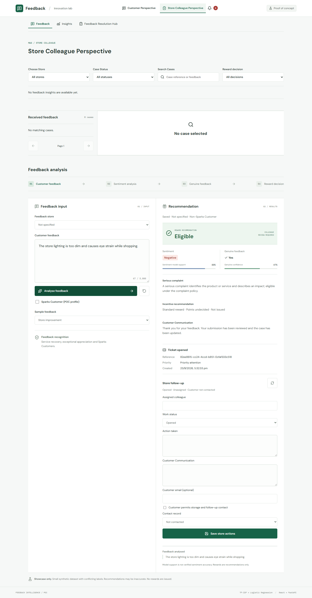

# Customer Feedback Reward Recommendation System

A local showcase POC: React + TypeScript + Vite, FastAPI, and two independently trained scikit-learn classifiers. No external AI service or API key is required. This is not a production reward system and does not issue rewards.

## Customer-to-colleague workflow

The default page is **Customer Perspective** (`/#customer`). Customers provide their name, an email or phone number, Sparks Customer status, a conditional Sparks ID, feedback and a 1-5 star rating. Store selection also supports a QR destination such as `/?store=bluewater#customer`. The privacy notice is placeholder wording pending business approval. Successful submission clears the form and shows a green confirmation with the case reference; failures retain all fields and retry with the same submission UUID.

**Store Colleague Perspective** (`/#feedback`) contains received customer cases, concise database-derived insights and the preserved analysis dashboard. **Feedback Resolution Hub** (`/#resolution-hub`) replaces the fictional Closed Loop demo; the old hash remains an alias. Store, status, search and final-decision filters sit above the case area. Case statuses are only **Opened**, **In Progress**, and **Resolved**. Forward transitions and direct Opened-to-Resolved are allowed; resolution requires a confirmed reward decision. A case cannot move backwards.

The bell shows unread cases across all stores and opens the newest unread case. Opening a case marks it read without finalizing its reward decision. Colleagues record their name, decision reason, optional internal note and status. Model recommendation and final decision are separate; final decisions start null. Missing/pending assessments, conflicting eligible/genuine signals or genuine confidence below `REWARD_REVIEW_THRESHOLD` (default `0.75`) require review. Negative sentiment alone never means ineligible. Existing usefulness, relevance, stock and incentive rules remain in use. No customer clarification is requested in the UI.

**Customer Communication** previews a generic template before the separate **Send customer update** action. Reward-specific templates require the matching saved colleague decision. Email success is explicitly labelled **POC simulation**; no email is actually delivered. Phone-only cases record a notification without claiming email delivery. Non-Sparks messages do not claim a Sparks account confirmation. The template, channel, time, simulation status and decision history persist in MongoDB. Rewards and Sparks balances are not issued or updated.

### Storage and compatibility

The existing MongoDB URI, database and `feedback` collection, local model artifacts, analysis history, training tools and SQLite tickets are retained. The same synchronous PyMongo client now also serves:

- `customer_profiles`: generated `customer_id`, name, email/phone, Sparks flag and nullable Sparks ID, UTC creation/update times. A profile belongs to one idempotent submission; unverified contact details are deliberately not used to merge identities.
- `feedback_cases`: `case_id`, linked `customer_id`, store, feedback, rating, actual model metadata, recommendation, colleague decision/reason/time, three-state workflow, notification state, simulated communication and activity history. Full customer details are not duplicated here.
- `feedback_case_events`: a single monotonic revision document for change signalling across API processes.

Unique indexes cover profile `customer_id` and case `case_id`. Cases also index `customer_id`, `store_id`, `case_status`, `created_at`, `notification.is_read` and newest-first pagination. Indexes are created on the first submission. Private retry hashes/operation IDs and MongoDB `_id` fields are excluded from responses. UUID retries prevent duplicate requests; they are not content-based fraud detection. Colleague writes use operation IDs and optimistic versions, returning 409 on conflicting edits.

No destructive migration is required. Legacy records remain in **Insights**, with their original assessments and real ticket actions; they are not invented customer profiles or included in new-case aggregates. Customer-case insights cover all matching MongoDB cases, not only the visible page, and reward totals count final colleague decisions (null counts as Awaiting Review). Profile, case and revision writes are retry-repairable but not a multi-document transaction on standalone MongoDB. An abandoned failed submission can leave an orphan profile; there is no automated reconciliation or retention job.

### Live notifications and API

The browser uses WebSocket `/api/colleague/events`. FastAPI checks the MongoDB revision once per second in a worker thread and pushes invalidation events, supporting standalone MongoDB without replica-set change streams or another messaging service. Events contain no customer details. Submission/read/action responses also refresh the current tab immediately. A ten-second notification poll and reconnect attempt provide fallback and recover missed events. All connections close on unmount. Reverse proxies must forward WebSocket upgrades; the Vite dev/preview proxies do so.

Browser routes below use `/api`; Vite strips that prefix for the existing FastAPI routing convention:

| Method | FastAPI route | Purpose |
| --- | --- | --- |
| POST | `/customer-feedback` | Validate profile/feedback, run existing inference, persist case, signal notification |
| GET | `/colleague/feedback-cases` | Store/status/search/final-decision filters; `page` and `page_size` pagination |
| GET | `/colleague/feedback-cases/{case_id}` | Case, linked customer and communication previews |
| PATCH | `/colleague/feedback-cases/{case_id}` | Versioned decision, status, reason, colleague and internal note |
| GET | `/colleague/notifications` | Unread count and up to 20 unread/recent references |
| PATCH | `/colleague/notifications/{case_id}/read` | Idempotent read state |
| POST | `/colleague/feedback-cases/{case_id}/notify-customer` | Versioned, idempotent simulated communication |
| GET | `/colleague/insights` | MongoDB aggregate metrics, optionally by store |
| WS | `/colleague/events` | Revision notifications |

Request/response models are documented in `/docs`. New optional backend variables are `REWARD_REVIEW_THRESHOLD` and `FEEDBACK_ALLOWED_ORIGINS` (comma-separated WebSocket browser origins, default localhost/127.0.0.1 on ports 5173 and 5174). Add the actual origin for alternative ports or preview port 4173. Existing `MONGODB_URI`, `MONGODB_DATABASE`, `FEEDBACK_TICKETS_DB` and Vite's `FEEDBACK_API_URL` are unchanged. No secrets or dependencies were added. Structured case log records use IDs and action names; access logs strip search query strings.

**Model limitation:** this repository has no DistilBERT pipeline. It intentionally uses local TF-IDF/Logistic Regression and VADER, which are preserved without retraining or downloads. Case records identify the real model names and SHA-256 artifact versions, not DistilBERT. Sentiment support is not calibrated VADER confidence. A DistilBERT replacement would be a separate, explicitly approved model change.

**POC boundary:** navigation is not authentication. There is no public profile-directory endpoint, but anyone with local API access can retrieve case-linked contacts. Use fictional data on localhost only. No identity verification, approved privacy/retention policy, real messaging, reward fulfilment, or production authorization is implemented.

Run the existing setup/start commands below. Validate with `python -m pytest backend/tests -q` using the project venv, `npm --prefix frontend run build`, `npm --prefix frontend run lint`, and `npm --prefix frontend run test:e2e`. Tests use disposable MongoDB databases and isolated API/frontend ports; they cover live inference, separate profiles, null Sparks IDs, retry protection, low-confidence review, status transitions, read state, communication, insights, cross-tab push, polling fallback and mobile/desktop layouts.

## Flow and business rules

```text
Customer feedback -> Sentiment model -> Positive / Neutral / Negative
                  -> Genuine-feedback model + decision rules -> Yes / No
                  -> Response policy -> Category / Ticket requirement
                  -> Incentive recommendation -> Reward Eligible / Not Eligible / Awaiting Colleague Review
                  -> Colleague confirmation -> Final decision / Generic communication / Resolution
```

All analysis runs locally: no Hugging Face, pretrained-model download, PyTorch, or external AI call. Sentiment labels now use VADER with bounded retail phrases and clause-level checks: praise is positive, problems negative, and mixed or unpolarised comments neutral. Courtesy words such as "please" do not turn a complaint positive. The original word TF-IDF + Logistic Regression sentiment model supplies support for the displayed label, not confidence in VADER's decision. Negation, sarcasm and complex mixed wording remain limitations; passing examples is not proof of general accuracy. Genuine feedback still uses the local word/character TF-IDF + Logistic Regression model and detail safeguards, independently of sentiment.

Reward eligibility is separate from the genuine-feedback label and sentiment. The POC response policy is:

| Feedback | Response | Incentive recommendation |
| --- | --- | --- |
| Minor compliment | Thank with context; close the loop | None for generic praise; tier-based for specific useful positive feedback |
| Gibberish | Ignore; no reply or ticket | None |
| Minor complaint | Apologise; open a ticket when details suffice, otherwise request details; record follow-up action | Tier-based when specific, genuine and useful |
| Serious complaint | Apologise; priority ticket for store action; ask for missing details | Automatically tier-based when sufficiently detailed; otherwise await customer details |
| Major compliment | Thank the customer for specific exceptional service recognition | Tier-based |
| Loyal customer with genuine meaningful feedback | Preserve category, thanks/apology, tickets and any outstanding questions | High tier, independently of the base incentive decision |

`incentiveTier` remains `none`, `tier_based`, or `high`. `high` means a high-tier Sparks recommendation. The rules above describe the underlying legacy predictor, not a final customer-case decision: the new workflow requires colleague confirmation and does not expose its clarification questions to customers. Amounts and fulfilment are not configured. Sparks status is self-declared, not an authenticated entitlement. Genuine means predicted usefulness, not verified truth. No rewards are issued. Named colleague assignment and store actions can still be saved on existing tickets.

The bounded English phrase rules in `backend/triage.py` consider serious issues first, then complaints, improvement suggestions and compliments. Major compliments require recognised exceptional-service wording, meaningful detail, a product/service subject and a genuine label. Specific actionable complaints and useful positive examples can qualify regardless of sentiment. Concrete store improvement suggestions have category `suggestion`; uncertain usefulness requests clarification. Loyalty can change eligibility but does not remove operational questions or alter ticket requirements/category. Gibberish remains ineligible. Complex negation, novel wording and severity remain limitations; production oversight is not implemented.

The genuine classifier and stock safeguards are unchanged: contextual stock feedback can set genuine to Yes; bare availability claims set it to No; other feedback uses a minimum-detail gate and the model. Specific timing such as "cakes sold out by 5pm" can earn a recommendation; "cakes sold out" still requests details. The synthetic training expansion below predates these policy/sentiment changes. Previously saved records retain their original assessment; new submissions and clarifications use the current policy.

This check addresses a real model failure: text with no TF-IDF features such as "Hi" previously defaulted to Yes from the classifier's intercept. Stopwords alone or a repeated known keyword could also cause false approvals. The safeguard uses distinct supported content words, not just message length. It is a heuristic, not semantic understanding: useful unfamiliar wording can be rejected and combinations of recognised keywords can still fool it. Better labelled data and independent evaluation remain necessary.

The reason is a transparent rule-based explanation of the prediction, not an LLM explanation or independently verified assessment of actionability. `genuine_feedback` is a synthetic proxy for usefulness, not proof that a person or statement is authentic.

## Structure

```text
feedback-reward-poc/
  frontend/
    src/App.tsx                Perspectives, legacy analysis and saved history
    src/App.css                Responsive workspace styling
    src/CustomerFeedbackForm.tsx Customer form, stars and success confirmation
    src/CustomerJourney.css     Customer and colleague workflow styling
    src/caseApi.ts              Typed API and live notifications
    src/FeedbackResolutionHub.tsx Live cases, review and communication
    src/ClosedLoop.css          Reused responsive case layout
    src/index.css              Typography and design tokens
    src/main.tsx               React entry point
    index.html
    vite.config.ts             /api proxy to FastAPI
    package.json
    package-lock.json
    playwright.config.ts
    tests/app.spec.ts          Live browser tests and screenshot capture
  backend/
    data/customer_feedback_training_data_300.csv
    data/genuine_feedback_synthetic.csv  Synthetic supplement, not real customer data
    training.py                Shared validation, training, evaluation
    train_sentiment.py
    train_genuine.py
    predict.py                 Model loading and reward rule
    triage.py                  Response and incentive policy
    tickets.py                 SQLite-backed local complaint tickets
    main.py                    FastAPI endpoints
    cases.py                   Customer profiles, cases, review APIs and events
    requirements.txt
    pytest.ini
    tests/test_api.py
    tests/test_cases.py
    sentiment_model.pkl        Generated by training
    genuine_model.pkl          Generated by training
    sentiment_metrics.json     Generated evaluation report
    genuine_feedback_metrics.json
  docs/screenshots/
    desktop.png
    mobile.png
  README.md
```

## Setup on Windows PowerShell

Prerequisites: Python 3.11+ (tested with 3.13), Node.js 22.12+ or a supported newer LTS, npm, and a running local MongoDB Community Server. MongoDB Compass is a viewer/client, not the database server. Run these commands from this project folder. The CSV has already been copied into `backend/data`; the original is unchanged.

```powershell
python -m venv .venv
.\.venv\Scripts\python.exe -m pip install -r backend/requirements.txt
.\.venv\Scripts\python.exe backend/train_sentiment.py
.\.venv\Scripts\python.exe backend/train_genuine.py
npm --prefix frontend ci
```

No virtual-environment activation is required. Both model files are created beside the scripts regardless of the working directory. To train on another CSV, pass `--data "C:\path\dataset.csv"` to each script. Restart FastAPI after retraining. Only load trusted, locally generated joblib files; pickle-based files can execute code.

The default genuine training command combines the original CSV with `backend/data/genuine_feedback_synthetic.csv`. Custom genuine datasets need only `feedback_text,genuine_feedback`, with labels `Yes` (specific/useful) and `No` (generic/insufficiently specific), not proof of authenticity. A custom `--data` file is used alone unless `--supplement` is explicitly supplied. Exact normalized duplicates are removed, conflicting genuine labels are rejected, and at least four unique examples per class are required to create the split, not to establish reliability. The default supplement contains 140 assistant-authored synthetic examples (70 Yes, 70 No) and requires human label review before any real deployment.

The latest expansion adds 60 examples: 30 specific/useful and 30 generic/insufficiently specific. Scenarios cover product performance, service recovery, accessibility, payment issues, facilities, vague praise, reward requests and nonsense. A few examples mention the three demo stores, paired with location-only and generic store comments labelled No. All such incidents are fictional, not reviews collected from those stores or claims about their service. No websites were scraped. Store names are not a separate model feature or an eligibility rule; their appearance in free text can still influence TF-IDF and needs monitoring. Specific positive feedback can be genuine without earning an incentive. This is a full local refit of TF-IDF and logistic regression, not transformer fine-tuning or a verified production-quality improvement.

```powershell
.\.venv\Scripts\python.exe backend/train_genuine.py --data "C:\path\reviewed_feedback.csv"
```

Terminal 1, from this project folder:

```powershell
.\.venv\Scripts\python.exe -m uvicorn main:app --app-dir backend --host 127.0.0.1 --port 8000 --reload
```

Terminal 2, from this project folder:

```powershell
npm --prefix frontend run dev
```

- App: http://127.0.0.1:5173 (use the URL Vite prints if that port is occupied).
- API documentation: http://127.0.0.1:8000/docs
- Readiness: http://127.0.0.1:8000/health

The frontend sends requests to `/api/predict`; Vite proxies to FastAPI's `/predict`, avoiding cross-origin browser requests. If port 8000 is occupied, choose another API port and set `FEEDBACK_API_URL` before starting Vite. Stop either server with Ctrl+C. Keep all services bound to localhost.

On macOS/Linux, replace `.\.venv\Scripts\python.exe` with `.venv/bin/python` and use `python3` to create the environment. Other commands are the same.

## MongoDB and saved analytics

The backend defaults to `mongodb://127.0.0.1:27017/`, database `feedback_reward_poc`, collection `feedback`. Connect Compass to that URI and open **feedback_reward_poc > feedback** after the first successful submission. No cloud service or API key is required. Optional `MONGODB_URI` and `MONGODB_DATABASE` environment variables override these defaults; set them in the backend terminal before starting FastAPI. Do not commit credentials or use a public unauthenticated database.

Every successful prediction is persisted, including ignored/non-genuine feedback. Each document contains feedback text, store ID/name/location, sentiment and confidence, genuine Yes/No and confidence, reward eligibility/decision/tier, loyalty flag, response/questions, ticket reference, timestamps and revision. The store defaults to **Not specified**; the three selectable stores use simple location labels only. Store selection is metadata, not an eligibility rule. An ignored classification means no response/reward/ticket, not that the record is discarded.

Open **Insights** at http://127.0.0.1:5173/#insights. Saved feedback survives refresh, tab closure and backend restarts. The dashboard initially loads the latest 100 conversations; **Load older feedback** fetches more. Totals and time/sentiment/store/customer-type filters apply to loaded records, not an unseen whole-database aggregate. Recent activity shows twelve five-minute intervals. Refresh fetches the latest page and merges records by ID/revision; it does not delete records. Changes from other clients appear after refresh, not via live push.

Use the open-folder button on a history row to reopen its saved result and ticket actions. Incomplete recommendations display **Awaiting Colleague Review**; the UI no longer asks customers questions. The legacy reassessment API remains compatible. Unsaved drafts are not retained across reloads. Existing SQLite tickets are not migrated into customer profiles; fictional demo cases have been replaced by the live Hub.

`GET /feedback?limit=100&before=<feedback UUID>` returns `{items, nextCursor}` newest first. Omit `before` for the first page; limits are 1-200. `GET /stores` returns the supported store metadata. Internal retry snapshots are not included in history responses. MongoDB outages return 503, and the UI does not falsely confirm a save. An ambiguous/lost response can still mean a write completed; retry with the same submission UUID to avoid a duplicate.

This is local POC storage with no authentication, customer-level access isolation, encryption configuration, retention/deletion workflow or backups. Anyone with API access can read all saved feedback. Use fictional feedback only and do not expose the API or MongoDB to a network. Loyalty is a self-selected flag, not an identified or verified customer profile.

Screenshots: [Insights desktop](docs/screenshots/analytics-desktop.png), [Insights mobile](docs/screenshots/analytics-mobile.png).

## Feedback Resolution Hub

Open **Feedback Resolution Hub** in Store Colleague navigation or visit http://127.0.0.1:5173/#resolution-hub. Submit a fictional customer case first; the Hub has no seeded or fabricated cases. Its filters, insights, decisions, communications and activity history use MongoDB. Customer cases persist across navigation and reload. Existing analysis-only records remain accessible from Insights and retain their SQLite workflows.

Screenshots: [Customer confirmation](docs/screenshots/customer-success-mobile.png), [Resolution Hub desktop](docs/screenshots/resolution-hub-desktop.png), [Resolution Hub mobile](docs/screenshots/resolution-hub-mobile.png).

## Prediction API

### Saved store follow-up

Analyse a complaint or reopen it from Insights. Under **Complaint ticket > Store follow-up**, enter a named colleague, choose **In Progress**, record actions and Customer Communication, then choose **Save store actions**. These preserved SQLite operations are separate from new customer-case review in the Hub. No staff directory or automatic on-call routing is configured; assignment is a manually entered name, not a verified staff account.

Customer email is optional and requires the permission checkbox. A saved owner, email, permission and update enable **Open email draft**, which opens the configured email client. The app does not send the message or verify delivery. Only after contacting the customer outside the app should a colleague select **Contact completed outside this app**. This is a self-reported contact record, not evidence of delivery. Resolving a ticket requires a named owner, completed action and customer update; resolution does not imply the customer was contacted. Status and contact record are shown separately.

`GET /tickets/{uuid}/workflow` loads the authoritative operational state. `PUT /tickets/{uuid}/workflow` accepts `operationId` (UUID), `expectedVersion`, `status` (`open`, `in_progress`, `resolved`), `assignee`, `actionTaken`, `customerUpdate`, `customerEmail`, `contactConsent` and `contactStatus` (`not_contacted`, `contact_recorded`). Each save appends a timestamped history entry in SQLite. Exact retries return the same snapshot, stale versions return 409, invalid contact/resolution fields return 422, missing tickets return 404 and storage failures return 503. Reload confirms before discarding unsaved form changes. Resolved workflows cannot be reopened through this form; clarification never resets operational history.

The original prediction's embedded ticket is an analysis snapshot. Its legacy `status: open` is not the current work status; use the workflow endpoint for that. Assignment/actions are stored separately from MongoDB prediction snapshots, avoiding a second write for each work update. No migration deletes or changes existing tickets.

Keep this on localhost with fictional contact details. There is no authentication, role enforcement, verified consent, encryption configuration, retention/deletion workflow or tamper-proof audit trail. Contact addresses also occur in saved history. Production needs those controls and a configured messaging/CRM integration before handling real customers.

### Legacy clarification API

The legacy `/clarify` contract and its tests remain available for compatibility, but no UI journey solicits customer clarification. New customer cases use colleague review instead. `clarificationQuestions` and `rewardDecision: "pending"` are retained in legacy analysis responses; the visible pending label is **Awaiting Colleague Review**. The following notes describe API-only reassessment, not the customer journey.

`POST /clarify` requires `feedbackId` from the saved prediction, `originalFeedback` (the complete previous conversation), `feedback` (the new reply), a fresh UUID `submissionId` for each distinct reply, and `ticketId` when a ticket exists. Send the saved `storeId` and `loyalCustomer`; changing them during clarification returns 409. Original feedback and reply are joined with two newlines and must total at most 5,000 characters. The same local models and policy reassess that combined text; no model retraining or external AI calls occur.

Existing-ticket updates and response snapshots are stored atomically in SQLite. Exact retries return the saved response without overwriting newer details. Changed reuse of a reply ID or stale previous feedback returns 409; missing tickets return 404; invalid input or a missing required ticket reference returns 422; model/storage unavailability returns 503. The UI preserves the previous result and reply on errors. Ticket reassessments retain the original ID and creation time. New minor tickets use the existing idempotent creation flow.

All saved conversations can be reopened from Insights after refresh. There is no authentication, verified identity, external messaging, safety escalation integration or compensation workflow. Use fictional feedback on localhost only. Priority attention is a ticket flag, not a claim that a colleague has been notified. Automation cannot verify an allegation or physical resolution, and serious incidents need a real operational escalation process before deployment.

MongoDB and SQLite are separate local stores, not a distributed transaction. A failed MongoDB write can leave a ticket saved while feedback saving is unconfirmed. Exact retries repair this path using the same submission/reply ID. MongoDB clarification writes use revision checks and preserve retry snapshots. This POC does not provide cross-store atomicity or automatic reconciliation for abandoned partial failures; production use needs a unified transactional persistence design or an outbox/reconciliation process.

Screenshots: [Clarification desktop](docs/screenshots/clarification-desktop.png), [Clarification mobile](docs/screenshots/clarification-mobile.png).

### Initial analysis

`POST /predict`, content type `application/json`:

```json
{ "feedback": "The colleague went above and beyond, finding my missing order and arranging delivery to my home.", "loyalCustomer": true, "storeId": "bluewater" }
```

Response shape (illustrative probabilities, not a promised output):

```json
{
  "feedbackId": "ce0c2b7f-dc5f-4055-870b-d3e93f0eb003",
  "feedback": "The colleague went above and beyond, finding my missing order and arranging delivery to my home.",
  "storeId": "bluewater",
  "store": { "name": "M&S Bluewater", "location": "Greenhithe, Kent" },
  "loyalCustomer": true,
  "createdAt": 1790251200000,
  "updatedAt": 1790251200000,
  "revision": 0,
  "sentiment": "Positive",
  "sentimentConfidence": 0.91,
  "genuineFeedback": "Yes",
  "genuineConfidence": 0.95,
  "rewardEligible": true,
  "category": "major_compliment",
  "rewardDecision": "eligible",
  "incentiveTier": "high",
  "ticketRequired": false,
  "ticket": null,
  "clarificationQuestions": [],
  "customerResponse": "Thank you for sharing how our team made a difference. We appreciate your detailed recognition.",
  "reason": "Genuine feedback from a loyal customer qualifies for a high-tier incentive recommendation. Points amounts are not configured."
}
```

`sentimentConfidence` is retained for API compatibility but is the original logistic model's support for the label selected by VADER/retail rules. The UI calls it **Sentiment model support**, not confidence in the new decision. `genuineConfidence` similarly remains model probability for the displayed genuine label even when a rule overrides it. Both can be below 50%; neither is calibrated accuracy, authenticity or severity confidence.

```powershell
Invoke-RestMethod -Uri http://127.0.0.1:8000/predict -Method Post -ContentType 'application/json' -Body '{"feedback":"The checkout queue is very long between 5 PM and 6 PM."}'
```

Input must be a string of 1-5,000 characters containing at least one letter. Optional `loyalCustomer` is a strict boolean, default false. `storeId` is `unspecified` (default), `marble-arch`, `stratford-city`, or `bluewater`. Optional `submissionId` is a UUID; the UI reuses it on retries and resets it when feedback, store or loyalty changes. Reusing an ID with different input returns 409. Separate IDs are separate submissions, even with identical text. Blank, numeric-only, malformed, oversized, and extra-field requests return 422. Unavailable models/storage return 503. `/health` reports `modelsLoaded` and `storageReady`; its HTTP 200 indicates API reachability, not full readiness.

When `ticketRequired` is true, the legacy analysis API also stores complaint text and ticket metadata in local `backend/tickets.sqlite3` (or `FEEDBACK_TICKETS_DB`). `GET /tickets/{uuid}` retrieves its analysis snapshot after restart; `/tickets/{uuid}/workflow` retrieves current assignment, actions, contact record and resolution. Retries reuse the ticket; conflicting reuse returns 409. Storage failures return 503 rather than a false confirmation. New customer submissions use MongoDB cases and the live Feedback Resolution Hub instead.

## Validation

### Genuine-feedback business criteria

Evaluate usefulness and specificity independently of sentiment, loyalty and reward eligibility. "Genuine" here does not verify identity or whether an account is true.

| Expected label | Characteristics |
| --- | --- |
| Yes | Specific customer experiences, actions taken, employee interactions, product experiences, issue descriptions or detailed observations |
| No | Only generic praise, very short uninformative comments, repetitive statements, vague appreciation or insufficient detail |

A product name or employee mention alone is insufficient: "The jacket" or "Helpful staff" does not describe what happened. A concise but specific report can be useful; do not reject it purely for being short. Longer repetition does not add information. Positive, negative and neutral feedback can each be genuine.

Run the separate local diagnostic benchmark from the project folder:

```powershell
.\.venv\Scripts\python.exe backend/evaluate_genuine.py
```

This reads `backend/data/genuine_business_evaluation.csv` and writes `backend/genuine_business_metrics.json`. It does not retrain models, store submissions or change reward decisions. The report includes the labelling rationale, raw model versus final pipeline predictions, detail-gate results, rule overrides, false positives/negatives, confusion matrices and breakdowns across all eleven business characteristics. `--cases` and `--output` select another labelled set/report; `--training-data` must name the actual training CSVs when evaluating a custom model so the overlap check is meaningful.

On the initial 22 assistant-authored cases (12 Yes, 10 No), the raw model had one false positive and no false negatives: "The jacket." was predicted Yes. The existing detail gate corrected it, so the final pipeline matched all 22 labels. No exact normalised training-text overlaps were found. These are small synthetic diagnostics with two examples per characteristic, not independent evidence of production accuracy; similar scenarios may exist in training. No runtime rule or model was changed based on this result.

For error review, examine the expected rationale first, then distinguish raw-model mistakes from detail/stock-rule mistakes. Prioritise false approvals of vague or repeated text and false rejections of specific experiences. Have business reviewers confirm disputed labels. Keep the benchmark out of training (the default training command does not load it); add separately reviewed examples to training only after analysis. Once these cases guide tuning, measure improvement on a fresh, independently labelled set and report both classes' precision/recall, not just overall accuracy. Do not tune thresholds just to make this diagnostic set pass.

```powershell
.\.venv\Scripts\python.exe -m pytest backend/tests -q
npm --prefix frontend run build
npm --prefix frontend run lint
```

Train both models and run local MongoDB on port 27017 before testing. Backend tests use uniquely named `feedback_reward_test_*` databases and remove only those databases. Tests cover model safeguards, incentive policy, loyalty, tickets, saved metadata, reconnects, clarification identity, pagination and unavailable storage/models.

Run the repeatable browser checks (the config starts its own isolated servers):

```powershell
npm --prefix frontend run test:e2e
```

On Windows the tests use installed Microsoft Edge. On other platforms they use Playwright Chromium; install it from `frontend` with `npx playwright install chromium`. To use Chromium on Windows, install it the same way and set `$env:PLAYWRIGHT_CHANNEL = 'chromium'`. Playwright starts API port 8001 and frontend port 5174, using a unique `feedback_reward_e2e_*` database and a temporary SQLite file. These ports must be free. The test helper only clears its generated test database; it never clears `feedback_reward_poc`. Interrupted runs can leave disposable test data behind.

The browser tests exercise the real API, reward examples, validation, loading locks, simulated 503 recovery and layouts at 320, 390, 768 and 1440 pixels. They verify saved analytics, tickets, store/Sparks retention, legacy API compatibility and the live customer-to-colleague workflow described above. They regenerate screenshots. Backend tests additionally verify local training and model reload with network connections disabled, training-data validation, duplicate isolation and expanded feedback examples. The backend test runner emits two dependency deprecation warnings.

For a local production-build preview, keep FastAPI running:

```powershell
npm --prefix frontend run build
npm --prefix frontend run preview
```

This preview also proxies `/api`. A deployed static build would need its own reverse proxy; deployment, authentication, rate limiting, and reward fulfilment are outside this POC.

## Dataset quality and limitations

The supplied 300-row CSV has only **25 unique feedback texts**. **10 text groups have conflicting sentiment labels**; for example, short generic comments occur under different sentiments. No labels were silently corrected. Genuine/reward labels agree for all rows.

Sentiment retains its original grouped holdout (89 rows), with 21.3% accuracy. Genuine training combines 300 original rows and 140 synthetic supplemental rows, deduplicating 440 rows to **165 unique texts**. A fixed-seed stratified split uses 123 texts for training and 42 for evaluation. TF-IDF is fitted only on the training partition during evaluation; a fresh final genuine model is then fitted on all 165 unique texts for this demo.

| Genuine classifier | Synthetic holdout accuracy | Macro F1 |
| --- | ---: | ---: |
| Word + character TF-IDF | 92.9% | 92.9% |
| Word-only baseline on the same split | 92.9% | 92.9% |

Genuine recall is 90.9% (20/22); not-genuine recall is 95.0% (19/20). Character features have **not** demonstrated an accuracy gain over the word-only baseline on this split. The earlier 74.1% accuracy used a different 27-example holdout; these scores are not directly comparable because the dataset and split changed. Full metrics and held-out predictions are in `backend/genuine_feedback_metrics.json`. The three held-out errors and the tiny synthetic sample still matter; this is not evidence of real-world accuracy.

The supplement adds clothing, returns, payments, delivery, accessibility, and service examples, plus greetings, nonsense, and long generic praise. It broadens vocabulary but is assistant-authored synthetic data, not independently reviewed customer evidence. Related scenarios may occur across the split. Human-labelled, independently held-out real feedback is still needed. Passing regressions after the final refit is **not** proof of unseen-data accuracy.

These scores evaluate the raw classifiers, not the combined model and decision rules. The stock rule uses an explicit product lexicon and phrase patterns, not general semantic understanding. The minimum-detail gate still requires some known vocabulary: genuinely useful unfamiliar feedback can still be rejected. Unfamiliar products, typos, complex negation, and keyword combinations remain limitations. Probabilities are not calibrated accuracy estimates.

Do not use this to make real reward decisions. Improve unique examples and label consistency, collect representative held-out data, assess per-class performance and calibration, and include human review before considering a real pilot. No inference-time duplicate detection is implemented; grouped evaluation only prevents duplicate leakage in measurement.

## Mockup and showcase walkthrough

Actual local captures: [Desktop screenshot](docs/screenshots/desktop.png) and [Mobile screenshot](docs/screenshots/mobile.png).



Desktop: a white header with a feedback icon and POC badge, followed by the project title and four compact workflow stages. A divided, two-column workspace places the textarea, sample selector, analyse button, and clear icon on the left. The right-hand results panel begins with an empty state, then shows an eligibility band, sentiment label, genuine label, two confidence bars, decision reason, and the exact submitted feedback. Green indicates eligibility; negative sentiment uses coral independently. A disclaimer remains below the workspace.

Mobile: the input and results stack vertically, the workflow becomes a two-column grid, and long feedback wraps inside a scrollable quotation. Controls have focus indicators and accessible labels. Loading is announced, duplicate submission is blocked, errors appear inline, and editing invalidates any previous result. Google Fonts are optional; local fallback fonts keep the UI usable offline.

Suggested showcase captures:

1. **Useful negative feedback:** select Store improvement, analyse, capture Negative / Yes / Eligible.
2. **Generic praise:** select Generic praise, analyse, capture No / Not eligible regardless of sentiment.
3. **Loyalty:** analyse specific useful feedback with loyalty off, then on. Genuine meaningful feedback from a loyal customer receives a high-tier recommendation. Generic praise and gibberish remain ineligible. Reopen a complaint from Insights to record assignment, completed actions and customer follow-up.
4. **Mobile result:** repeat Store improvement at a 390px viewport.

## Future enhancements

Future versions could connect actual store QR registration, colleague alerts, assignment, customer conversations, evidence-backed resolution, verified loyalty profiles and incentive distribution. Tier amounts and fulfilment rules remain future work; current tier labels are recommendations only. Additional prerequisites include better labels, independent evaluation, calibrated probabilities, privacy controls, authenticated access, duplicate/fraud prevention, monitoring, and a human approval step.