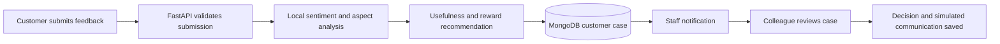

# Presentation Script and Demo Flow

This is a seven-minute presentation for the local Customer Feedback Reward Recommendation POC. Use fictional customer details only.

For endpoint-level questions during the presentation, use the separate [API Endpoint Reference](API_ENDPOINTS.md).

## Before You Present

1. Start MongoDB, FastAPI, and the Vite frontend.
2. Confirm `http://127.0.0.1:8000/health` reports `status: ready`.
3. Open `http://127.0.0.1:5173/#customer` in one browser tab.
4. Open `http://127.0.0.1:5173/#feedback` in a second tab and sign in as the local admin.
5. Keep the customer and staff tabs visible side by side.

Demo feedback:

```text
The cakes are fresh but sold out by lunchtime. The staff were not helpful.
```

Suggested fictional customer details:

```text
Name: Demo Customer
Email: demo.customer@example.com
Store: M&S Bluewater
Rating: 2 stars
```

## Presentation Flow



## Talk Track

| Time | Screen and action | What to say |
| --- | --- | --- |
| 0:00-0:40 | Title or customer tab | "This POC turns customer feedback into a structured case for store colleagues. It keeps the customer journey separate from the staff workspace and runs fully locally, without an external AI API." |
| 0:40-1:30 | Customer form | "A customer selects a store, gives a star rating, and describes their experience. The form validates contact details and assigns an idempotent submission reference so retrying does not create duplicate cases." |
| 1:30-2:10 | Submit the demo feedback | "This comment is intentionally mixed: product freshness is positive, availability is negative, and staff service is negative. A single overall label would hide that detail." |
| 2:10-2:50 | Customer confirmation | "The customer receives a confirmation and case reference. No reward is issued here; the recommendation still requires colleague review." |
| 2:50-3:40 | Staff Feedback tab and notification | "The new case appears in the Store Colleague workspace. Staff use Store, Case Status, and Reward Decision filters, then open the case from the received-feedback list." |
| 3:40-4:35 | Case detail and aspect results | "The system shows overall text sentiment, the rating comparison, usefulness, and sentiment by aspect with the supporting clause. Here we can see Positive Product quality, Negative Availability, and Negative Staff and service." |
| 4:35-5:30 | Resolution actions | "A colleague records the final GBP incentive decision, reason, owner, and case status. This separates automated recommendation from a human decision. Customer communication is a recorded POC simulation; it does not send email or transfer money." |
| 5:30-6:20 | Persistence explanation | "The customer profile and case persist in MongoDB. The case contains the feedback, rating, model output, aspect evidence, colleague decision, communications, and activity history. The UI can be refreshed without losing the case." |
| 6:20-7:00 | Close | "The POC demonstrates local feedback classification and an auditable colleague workflow. It is not production-ready: training data is synthetic, metrics are not real-world evidence, rewards are not issued, and messaging is simulated." |

## What Persists Where

| Information | Storage | Purpose |
| --- | --- | --- |
| Customer name, email, phone, Sparks fields | MongoDB `customer_profiles` | Linked customer profile for one submitted case |
| Customer feedback, rating, sentiment, aspects, recommendation, review and communication history | MongoDB `feedback_cases` | Resolution Hub case record |
| Case-change revision | MongoDB `feedback_case_events` | Staff notification invalidation |
| Legacy staff analysis results | MongoDB `feedback` | Separate `/predict` analysis history |
| Legacy ticket workflow actions | SQLite `tickets.sqlite3` | Separate legacy complaint-ticket workflow |
| Original and synthetic training examples | CSV files in `backend/data/` | Offline model training only |
| Trained local sentiment model | `backend/sentiment_model.pkl` | Loaded when FastAPI starts |

The 540 generated aspect-focused examples are stored in `backend/data/sentiment_aspect_synthetic.csv`. Customer submissions do not automatically enter this CSV or retrain the model. A human must review and label real feedback before adding it to a training dataset and rerunning training.

## Questions You May Get

**Does the system send rewards or email?**

No. It records a recommendation and simulated customer communication only.

**Does the model use an external AI service?**

No. The sentiment LSTM, aspect rules, and usefulness classifier run locally.

**Can the model learn from every customer submission?**

No. Customer cases are stored separately from training data. Retraining is an offline, reviewed process.

**How reliable is the model?**

The reported holdout includes synthetic data with repeated structures and is likely optimistic. It demonstrates the pipeline, not production accuracy. Real, independently labelled feedback is required before operational use.

## Closing Statement

"This POC shows a practical closed loop: customers give feedback, local analysis extracts useful signals and aspect-level sentiment, colleagues make the final decision, and the full case history is retained for review. The next step is to validate it with diverse human-labelled feedback and connect approved reward and communication systems."