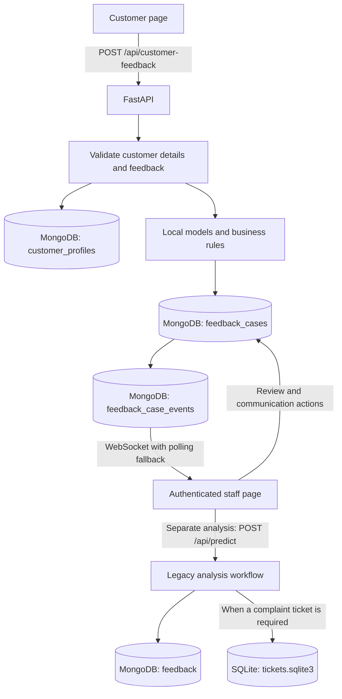

# Customer Feedback: Workflow and Data Storage

This guide describes the current local application, including customer submission, automated assessment, staff review, and persistence. The application recommends rewards and records simulated customer email messages; it does not deliver actual email or issue rewards.

## 1. System Overview                     

| Component | Responsibility |
| --- | --- |
| React frontend | Customer form, admin login, staff case management, analysis and insights |
| Vite | Serves the frontend and proxies browser `/api` requests to FastAPI |
| FastAPI backend | Validates requests, checks staff sessions, runs models, reads and writes databases |
| Local model artifacts | Sentiment classification and a separate usefulness classifier |
| MongoDB | Customer profiles, feedback cases, staff reviews, simulated communications, analysis history and admin sessions |
| SQLite | Complaint tickets and ticket actions from the separate staff analysis workflow |



The two workflows share the predictor but do not share the same records. A customer submission does **not** automatically create a legacy analysis-history record or a SQLite ticket.

## 2. Customer Journey

Customer URL: http://127.0.0.1:5173/#customer

The customer page has no staff navigation or admin login link.

1. The customer enters feedback, selects a 1-5 star rating, and provides their name and email. Phone is optional. Sparks membership defaults to No; selecting Yes requires a Sparks ID. A store can be selected, or left as Not specified.
2. Browser validation checks the fields. The backend independently validates submitted values, so bypassing the browser does not bypass the requirements.
3. The browser creates a submission UUID and sends `POST /api/customer-feedback`. Vite removes `/api`, forwarding the request to FastAPI's `/customer-feedback` endpoint.
4. The backend uses that UUID as the `case_id` and derives a stable `customer_id` for this submission. It saves the contact details in `customer_profiles`.
5. The backend runs the existing predictor, compares the text sentiment with the star-rating signal, and saves the assessment in `feedback_cases`. The new case starts as `Opened`, with an unread notification and no final colleague decision.
6. The backend increments the case revision counter and returns the case reference. Only a successful response produces the success message and resets the form.

### Validation and Retry Behaviour

- Feedback must contain a letter and cannot exceed 5,000 characters.
- Name must be nonblank; email is required and must have a valid format.
- An optional phone number, when provided, must have 7-15 digits and an accepted format. The API normalizes its formatting.
- Sparks ID is required only when Sparks membership is Yes. Otherwise the stored ID is null.
- Rating must be an integer from 1 to 5; store must be one of the configured choices.
- Retrying unchanged input uses the same submission UUID, preventing duplicate profiles/cases. Reusing that UUID with different data is rejected.
- Profiles are per submission, not a verified customer directory. Separate submissions using the same email are not automatically merged.

## 3. Automated Assessment

The backend assesses two different questions:

| Assessment | Meaning | Implementation |
| --- | --- | --- |
| Sentiment | Does the text read as Positive, Neutral or Negative? | Local PyTorch bidirectional LSTM; local aspect rules |
| Genuine/useful feedback | Does the feedback contain sufficiently useful, specific information? | Separate TF-IDF + Logistic Regression classifier with detail checks and business rules |

"Genuine" does not establish that the customer or incident is authentic. It is a usefulness assessment, not identity verification or fraud detection.

The predictor combines usefulness with business rules to suggest a reward decision, feedback category and incentive tier. Negative sentiment alone does not make feedback ineligible. Sparks status can affect the suggested incentive tier, but is self-declared and does not prove an entitlement.

The star rating is not passed to the text classifier. The case workflow separately maps 1-2 stars to Negative, 3 to Neutral, and 4-5 to Positive. A mismatch flags the case for colleague review; it does not replace the predicted text label.

Aspect analysis emits one entry per recognised aspect-bearing clause, including its polarity and a short text excerpt. The local vocabulary covers product quality, availability, staff/service, checkout/payment, delivery/online ordering, returns/refunds, store environment, price/value and accessibility. It splits contrastive wording and separates different aspects joined by “and”; clear polarity and negation cues determine aspect sentiment, with the local LSTM used when no clear cue is found. Entries are saved under `sentiment.aspects` for customer cases and as `aspects` for legacy predictions, and are shown to colleagues during case review. This is a bounded English heuristic, not a pretrained ABSA model; ambiguous wording, complex negation, sarcasm and unrecognised aspects remain error-prone.

The model recommendation is one of:

- `Reward Eligible`
- `Not Eligible`
- `Awaiting Colleague Review`

Review is required when usefulness confidence is below `REWARD_REVIEW_THRESHOLD` (default 0.75), the predictor decision is pending, eligibility conflicts with usefulness, or star rating conflicts with text sentiment. The final colleague decision remains null until staff save a decision, even when the model recommends eligibility.

Model files are loaded when the backend starts. Each case records the assessment and model-version identifiers used at submission time. Retraining does not automatically reassess existing cases, and submitting feedback does not automatically retrain either model.

### How the Models Process Text

The LSTM lowercases the text, splits it into tokens, maps tokens to learned vocabulary IDs and uses at most the first 100 tokens. Unknown tokens receive an unknown-word ID. When every token is unknown, such as a greeting with no learned vocabulary, inference returns a modest Neutral fallback instead of treating the unknown token as evidence of negative sentiment. A 64-dimensional embedding feeds an LSTM with 32 hidden units in each direction. A linear layer and softmax produce three scores; the largest score determines the overall sentiment label. Punctuation is not retained by the current tokenizer. This model does not use BERT, VADER or an external AI service.

The usefulness pipeline transforms text into word unigram/bigram and character 3-5-gram TF-IDF features. Balanced Logistic Regression predicts Yes/No. Additional checks for meaningful details and stock availability can override that label before the business rules calculate the recommendation. The displayed usefulness score remains a classifier score, not proof that the final rule-adjusted outcome is correct.

Training is a separate offline process: load local CSVs, validate labels, handle duplicates/conflicts, split training/evaluation text, fit and evaluate, then refit the final artifact. No live customer name, email or phone is sent to either model; the predictor receives the feedback text and self-declared Sparks flag, with the latter used by incentive rules.

The checked-in [sentiment_metrics.json](../backend/sentiment_metrics.json) reports **92.9% accuracy (143 of 154 examples)** and 93.0% macro F1 on its mixed original/synthetic holdout. This was recalculated after adding a 540-row aspect-focused synthetic supplement. Those rows use reusable sentence frames, so related vocabulary and structure can occur in both partitions; the score is likely optimistic, is not comparable to the earlier 31.6% result, and is not production-quality evidence of reliable sentiment, aspect or sarcasm detection. The reported evaluation and the currently loaded artifact should be reassessed after any retraining.

## 4. Staff Journey

Staff URL: http://127.0.0.1:5173/#feedback

Staff open this URL separately. The staff page can open the customer page in another tab without replacing the staff view.

1. On first use on this computer, create the single admin account. There are no default credentials. Subsequent visits require admin login.
2. The **Feedback** view combines customer-case management, its customer-case summary, and the separate analysis tool. The **Insights** tab currently shows saved staff analysis history, not a merged customer-case dashboard.
3. A notification bell identifies unread cases. The backend sends case-change signals over an authenticated WebSocket; a ten-second poll provides fallback. Opening a case marks it read, without approving a reward.
4. Staff review the customer's details, original feedback, rating, sentiment and reward recommendation.
5. Staff save a decision with colleague name, decision reason, optional internal note and case status. Model recommendation and colleague decision are stored separately.
6. Case statuses move forward through `Opened`, `In Progress` and `Resolved`. Direct resolution is allowed when its requirements are met; backward status changes are rejected. Resolving requires a definite colleague reward decision.
7. A separate communication action records the selected message/template. Reward-specific messages require the corresponding saved decision.

**Communication is simulated.** Each feedback submission records the same generic acknowledgement before analysis. If analysis makes the submission eligible for a reward, one separate eligibility follow-up is recorded afterward; its deterministic submission/type key prevents duplicate follow-ups on retries. The messages are visible in the customer confirmation and staff detail, but are not delivered by email/SMS. The app also does not transfer a GBP incentive or update a Sparks balance.

Updates include an operation UUID and expected record version. Retrying the same operation is safe; a conflicting concurrent edit requires a reload instead of silently overwriting newer work.

### Interpreting the Totals

Customer-case summaries come from server-side MongoDB aggregates over `feedback_cases`, optionally filtered by store. Their reward totals use the **final colleague decision**; null is counted as Awaiting Review. These totals are not limited to the visible case-list page.

The separate Insights tab calculates charts from the currently loaded `feedback` analysis-history records and selected filters. Additional history must be loaded for those records to enter its totals. Its eligibility totals are **model/rule recommendations**, not confirmed customer-case decisions or issued rewards. A customer-form submission therefore does not automatically increase the Insights tab's analysed-feedback count.

## 5. Where Data Persists

### Primary Database: MongoDB

Default connection: `mongodb://127.0.0.1:27017/`

Default database: `feedback_reward_poc`

These are configured in [backend/feedback_store.py](../backend/feedback_store.py). `MONGODB_URI` and `MONGODB_DATABASE` override the defaults in the backend process.

| Collection | Persisted information |
| --- | --- |
| `customer_profiles` | `customer_id`, name, email, optional phone, Sparks membership/ID, creation/update times and private retry fingerprint |
| `feedback_cases` | `case_id`, linked `customer_id`, feedback, rating, store, sentiment, model recommendation, final staff decision, status, notification state, simulated communication, activity history, version and retry-operation data |
| `feedback_case_events` | A revision counter used to signal case changes; not a separate full audit-history collection |
| `feedback` | Saved results from the staff analysis tool: feedback, store, loyalty, sentiment/usefulness scores, reward recommendation, ticket reference, timestamps and clarification/retry data |
| `admin_accounts` | Admin username, random salt and password hash; not a plaintext password |
| `admin_sessions` | Hashes of opaque session tokens, username and session expiry |
| `admin_login_attempts` | Short-lived login-attempt counters used for throttling |

Customer contact details are separated from case documents, but stored in the **same MongoDB database**, not a separate customer database.

The link is:

```text
feedback_cases.customer_id  ->  customer_profiles.customer_id
```

The backend joins those records when staff open a case. Individual review/communication events are embedded in `feedback_cases.activity_history`.

MongoDB stores its physical database files in the MongoDB server's configured `storage.dbPath`, not inside the frontend or automatically inside this repository. MongoDB Compass is a viewer, not the storage engine. Changing the application database name does not change the server's disk location.

**Verified on this computer on 30 September 2026:** the MongoDB server at `127.0.0.1:27017` reports `storage.dbPath` as `C:\Program Files\MongoDB\Server\8.0\data`. The `feedback_reward_poc` database exists and contains all seven collections listed above. This directory belongs to the database server and can differ on another installation. It contains engine-managed files, not one editable JSON file per collection. Use Compass or MongoDB backup tools instead of editing or copying individual engine files while the server is running.

### Secondary Database: SQLite

Default file: [backend/tickets.sqlite3](../backend/tickets.sqlite3)

The backend resolves this path relative to its own directory. `FEEDBACK_TICKETS_DB` can override it. Initialization is in [backend/main.py](../backend/main.py); table definitions and writes are in [backend/tickets.py](../backend/tickets.py).

| Table | Persisted information |
| --- | --- |
| `tickets` | Legacy complaint reference, submission ID, feedback, category, reward decision, priority, initial status and creation time |
| `ticket_reassessments` | Clarification/reassessment requests and cached responses for safe retries |
| `ticket_workflows` | Current ticket workflow as JSON: status, assignee, permitted contact details, actions, customer update, version and history |
| `ticket_workflow_operations` | Operation IDs and request/response data for versioned, repeat-safe updates |

Only the separate staff analysis/legacy clarification path creates and updates these tickets. A new customer `feedback_case` is already its own case-management record; it is not mirrored into SQLite.

### Model and Training Files

The backend also persists files in the project directory:

- `backend/sentiment_model.pkl`: trained LSTM wrapper and vocabulary.
- `backend/genuine_model.pkl`: trained usefulness classifier pipeline.
- CSV files under [backend/data](../backend/data): source/synthetic training and evaluation data.
- JSON metrics under [backend](../backend): generated training/evaluation reports.

These files are not the live customer-feedback database. Model loading uses trusted local joblib artifacts; do not load untrusted model files.

### Browser State

Form drafts, selected cases, filters and loaded results are React state. They are not a durable customer-data database; a full page reload can discard an unsent draft. Keeping customer and staff in separate tabs avoids replacing the customer's current page, but does not make drafts persistent.

The browser holds an HttpOnly admin session cookie. The backend stores only the corresponding token hash. Sessions last up to eight hours and can survive a backend restart; logout revokes the session. Cookie expiry and backend expiry are enforced independently of MongoDB's eventual TTL cleanup.

## 6. Viewing the Saved Data

### MongoDB Compass

1. Open MongoDB Compass and connect to `mongodb://127.0.0.1:27017/` for the default local setup.
2. Open the `feedback_reward_poc` database.
3. Open `feedback_cases` and filter by the reference shown after submission:

```json
{ "case_id": "REPLACE_WITH_CASE_REFERENCE" }
```

4. Copy that document's `customer_id` and query `customer_profiles`:

```json
{ "customer_id": "REPLACE_WITH_CUSTOMER_ID" }
```

5. Review `reward_assessment`, `customer_communication` and `activity_history` on the case for saved staff work.
6. Use the `feedback` collection for results created with the separate **Analyse feedback** button. Do not expect customer-form submissions to appear there.

To inspect SQLite, open the ticket database in a SQLite viewer, preferably read-only while the app is running. Do not manually edit production records or database engine files to change workflow state.

## 7. Durability, Security and Limits

- Closing a browser or restarting FastAPI does not normally delete saved MongoDB records or the SQLite file. Restarting MongoDB also retains its disk-backed data unless its data directory is removed or replaced.
- Committing/pushing the source repository does not back up MongoDB. A complete backup needs the MongoDB database, the SQLite database, and any required model/configuration files. Backups contain private data and must be protected.
- Profile creation, case creation and revision updates are separate MongoDB writes, not one transaction. A failed submission can leave a profile without a completed case. Retrying the same submission repairs this path; abandoning it can leave an orphan profile.
- MongoDB and SQLite are also not covered by a shared transaction. A failed legacy analysis save can occur after ticket creation; matching submission IDs support retries.
- HTTP staff endpoints and notification WebSockets require an admin session. Hiding the staff link is a UI separation, not the security boundary; backend session checks enforce access.
- The local admin login does not secure direct access to the database server or filesystem. Keep MongoDB and the application private, protect the host, and use fictional data for this demo.
- There is no production customer identity verification, per-store staff authorization, approved retention/deletion workflow, password recovery, real messaging or reward fulfilment.
- The LSTM is experimental and trained on a small dataset including synthetic examples. Softmax scores are not calibrated confidence or proof of correctness. Colleague review remains necessary.

## 8. Running and Checking the Application

MongoDB must be running first. From the project root, start the backend and frontend in separate PowerShell terminals:

```powershell
.\.venv\Scripts\python.exe -m uvicorn main:app --app-dir backend --host 127.0.0.1 --port 8000
```

```powershell
npm --prefix frontend run dev
```

The workspace also has configured FastAPI and React tasks. Do not start a duplicate server if the appropriate task is already running. Vite may choose another port if 5173 is occupied; use its printed URL and configure allowed origins when changing ports.

Check http://127.0.0.1:8000/health for `modelsLoaded: true` and `storageReady: true`. This health check covers predictor availability and MongoDB connectivity; it is not a full SQLite, login or model-quality test. Staff can open API documentation at http://127.0.0.1:8000/docs after signing in on `127.0.0.1`. Use the same hostname for login and documentation because the session cookie is host-scoped; `localhost` and `127.0.0.1` are not interchangeable for that cookie.

Application configuration is in process environment variables, not the customer form:

| Variable | Purpose |
| --- | --- |
| `MONGODB_URI` | MongoDB server connection |
| `MONGODB_DATABASE` | Database name, default `feedback_reward_poc` |
| `FEEDBACK_TICKETS_DB` | Override the SQLite ticket file |
| `FEEDBACK_API_URL` | Vite's backend proxy destination, normally `http://127.0.0.1:8000` |
| `REWARD_REVIEW_THRESHOLD` | Usefulness review threshold, default `0.75` |
| `FEEDBACK_ALLOWED_ORIGINS` | Allowed browser origins for HTTP/WebSocket access |
| `FEEDBACK_COOKIE_SECURE` | Set to `1` when deploying behind HTTPS; not a replacement for HTTPS |

Credentials are chosen in the initial local admin setup form. Passwords use a salted PBKDF2-HMAC-SHA256 hash with 600,000 iterations. Do not put passwords, session tokens or database credentials into source code, screenshots or shared documentation.

## 9. Implementation References

| Topic | Source |
| --- | --- |
| Customer form and browser validation | [CustomerFeedbackForm.tsx](../frontend/src/CustomerFeedbackForm.tsx) |
| Staff login screen | [StaffAccess.tsx](../frontend/src/StaffAccess.tsx) |
| Navigation and separate staff analysis | [App.tsx](../frontend/src/App.tsx) |
| Staff case review and communication | [FeedbackResolutionHub.tsx](../frontend/src/FeedbackResolutionHub.tsx) |
| Browser API and notifications | [caseApi.ts](../frontend/src/caseApi.ts) |
| Backend startup, security boundary and legacy endpoints | [main.py](../backend/main.py) |
| Admin account/session persistence | [auth.py](../backend/auth.py) |
| Customer validation, case persistence and review rules | [cases.py](../backend/cases.py) |
| MongoDB configuration and legacy history | [feedback_store.py](../backend/feedback_store.py) |
| SQLite ticket persistence | [tickets.py](../backend/tickets.py) |
| Models and reward decision pipeline | [predict.py](../backend/predict.py) |
| LSTM implementation | [sentiment_lstm.py](../backend/sentiment_lstm.py) |
| Business categories and incentive rules | [triage.py](../backend/triage.py) |
| Training and evaluation | [training.py](../backend/training.py) |

See [README](../README.md) for installation, startup and test commands.